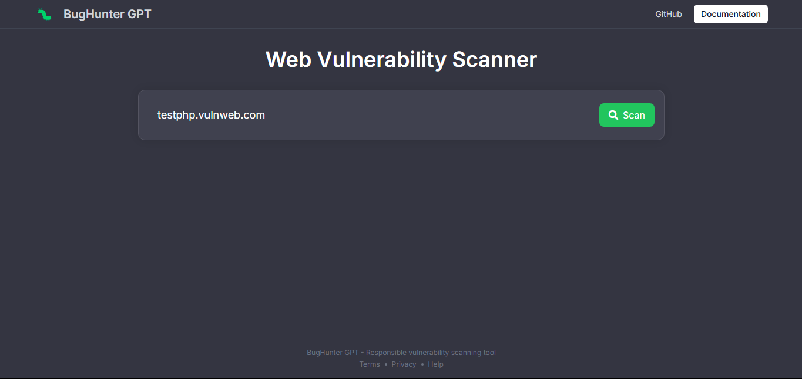
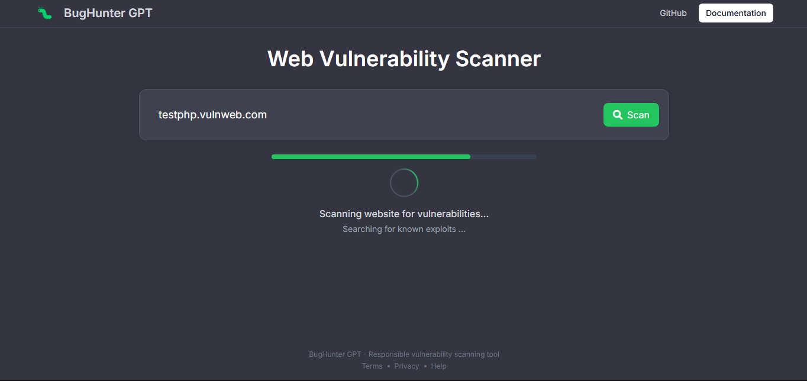

# BugHunter GPT 🐛

A modern web vulnerability scanner that leverages GitHub's exploit database to identify potential security issues in web applications.

## Features

- 🔍 **Comprehensive Vulnerability Scanning**
  - Website availability checking
  - Automated page crawling
  - GitHub exploit database integration
  - Real-time vulnerability analysis

- 📊 **Advanced Scanning Visualization**
  - Interactive progress tracking
  - Phase-by-phase status updates
  - Visual feedback for scan progress
  - Severity-based result categorization

- 🛡️ **Security Checks**
  - SQL Injection vulnerabilities
  - Cross-Site Scripting (XSS)
  - Remote Code Execution
  - Cross-Site Request Forgery
  - File Inclusion vulnerabilities
  - Open Redirects
  - Server-Side Request Forgery

- 📝 **Detailed Reporting**
  - Severity-based categorization
  - Page-by-page analysis
  - GitHub exploit references
  - Actionable security insights

## Quick Start

1. Clone the repository:
```bash
git clone https://github.com/atulhacks/bughunter-gpt.git
cd bughunter-gpt
```

2. Start the server:
```bash
# Using the start script
./start.sh

# Or using Python directly
python3 -m http.server 8000
```

3. Open your browser and visit:
```
http://localhost:8000
```

## Usage Guide

1. Enter the target website URL in the input field
2. Click the "Scan" button to initiate the vulnerability assessment
3. Monitor the scanning progress through the visual indicators:
   - Website availability check
   - Page crawling status
   - Exploit search progress
   - Vulnerability analysis
4. Review the comprehensive results:
   - Critical vulnerabilities
   - Known exploits
   - Security recommendations
   - Detailed page analysis

## Screenshots

### Main Interface

*The main scanning interface with URL input and controls*

### Scanning Progress

*Real-time scanning progress with phase indicators*

### Results Display

*Detailed vulnerability scan results and findings*

## Project Structure

```
bughunter-gpt/
├── index.html              # Main application interface
├── script.js              # Core scanning functionality
├── start.sh              # Server startup script
├── README.md             # Project documentation
├── LICENSE              # MIT license
├── CONTRIBUTING.md      # Contribution guidelines
├── SECURITY.md         # Security policy
└── PROJECT_STRUCTURE.md # Codebase organization
```

For detailed information about the project structure and implementation, see [PROJECT_STRUCTURE.md](PROJECT_STRUCTURE.md).

## Contributing

We welcome contributions! Please read our [Contributing Guidelines](CONTRIBUTING.md) for details on how to submit pull requests, report issues, and contribute to the project.

## Security

For details about our security policy and how to report vulnerabilities, please see our [Security Policy](SECURITY.md).

## License

This project is licensed under the MIT License - see the [LICENSE](LICENSE) file for details.

## Support

If you encounter any issues or have questions:
1. Check the [existing issues](https://github.com/atulhacks/bughunter-gpt/issues)
2. Review the [documentation](PROJECT_STRUCTURE.md)
3. Open a new issue if needed

## Acknowledgments

- Built with modern web technologies
- Powered by GitHub's API for exploit detection
- Uses Tailwind CSS for styling
- Font Awesome for icons

## Disclaimer

This tool is for educational and ethical testing purposes only. Always ensure you have permission to scan any target website. The developers are not responsible for any misuse or damage caused by this tool.
